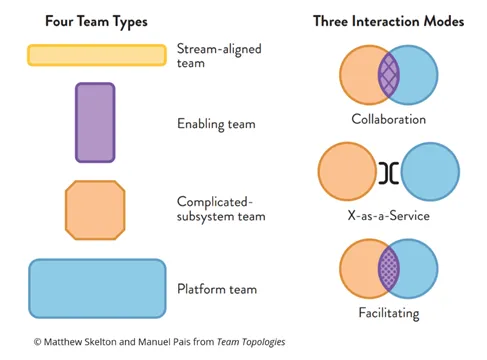
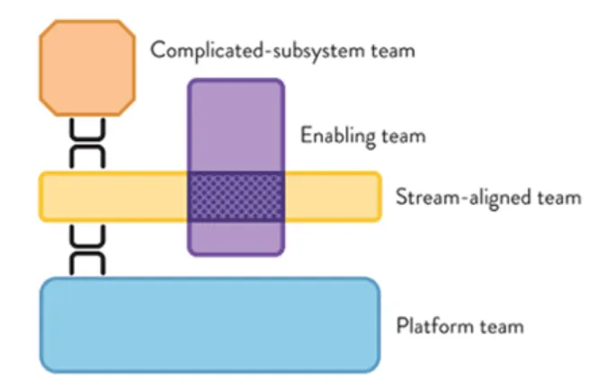

# Career and Team Roles

## Team Roles

**Squad Lead**: Manages squad health and performance, recruits team members, sets milestones, and clarifies ambiguities. Ensures alignment with organizational goals.

**Tribe Lead**: Oversees multiple squads or a tribe, sets strategic direction, ensures cohesion among squads, and fosters a culture of collaboration and innovation.

**Product Manager**: Deciphers customer needs, sets product scope, provides requirements, makes final user-facing decisions, and clarifies ambiguous product needs. Balances Technical Program Manager and Product Manager roles.

**Engineering Manager**: Responsible for recruiting new team members, ensuring team health, managing team members' performance and growth. They also set scope and milestones in collaboration with the Product Manager. This is a management role.

**Chapter Lead**: Leads a chapter, or a group of individuals with similar skills or roles within different squads. Mentors members, guides professional growth, and maintains a shared culture and best practices.

**Tech Lead**: Responsible for making final decisions on the technical approach of projects, designing high-level architecture, and supporting the engineering team in coding, testing, and system operations. They also mentor and coach team members on technical topics. This is a mix of a technical and management role.

**Guild Lead**: Leads a guild, a group of people across the organization with shared interests or expertise. Facilitates knowledge sharing, promotes best practices, and encourages cross-team collaboration.

**Software Engineer**: Codes, tests, deploys, and monitors systems with TL support. Collaborates on software component design and development.

## Software Engineering Levels

Legend

- *L* - Level
- *IC* - Individual Contributor
- *TL* - Technical Leadership
- *M* - Management
- *SWE* - Software Engineer

 

### Junior Software Engineer (SWE: L1 - IC1)
With limited experience (up to 2 years), assists in coding, testing, and stabilizing systems under supervision. Communicates with immediate team members and solves straightforward problems with guidance. Should display a willingness to learn and grow professionally. This is an individual contributor role.

- [ ] (Collaboration) Collaborated with team members to deliver software components.
- [ ] (Communication) Communicated effectively with immediate team members.
- [ ] (Communication) Actively listened and demonstrated effective communication skills.
- [ ] (Communication) Asked questions to clarify requirements and instructions.
- [ ] (Communication) Engaged in team discussions and provided updates on progress.
- [ ] (Communication) Provided clear and concise written documentation.
- [ ] (Problem Solving) Solved straightforward problems with guidance.
- [ ] (Measurable) Contributed to at least 10 pull requests each month with valuable and well-written contributions.
- [ ] (Learning) Demonstrated ongoing learning and development by acquiring new technical skills.
- [ ] (Technical Skills) Demonstrated basic understanding of software development principles.

### Mid-level Software Engineer (SWE: L2 - IC2)
With a certain level of proven experience (2-5 years), contributes to software development, solves moderate problems, and starts handling ambiguous situations with minimal guidance. Communicates with the broader team and engages in code reviews and documentation. This role also includes mentorship of junior engineers and a commitment to continuous learning. This is an individual contributor role.

- [ ] (Collaboration) Collaborated with cross-functional teams to deliver project milestones.
- [ ] (Communication) Communicated effectively with the broader team and engaged in code reviews.
- [ ] (Communication) Actively participated in team discussions and shared ideas and insights.
- [ ] (Communication) Presented technical concepts and solutions clearly and concisely.
- [ ] (Communication) Listened attentively and provided constructive feedback to peers.
- [ ] (Communication) Provided clear and concise documentation for code and project components.
- [ ] (Problem Solving) Solved ambiguous problems with minimal guidance.
- [ ] (Measurable) Created and successfully merged at least 10 pull requests each month without major corrections.
- [ ] (Measurable) Developed automated tests for at least 80% of code written.
- [ ] (Mentorship) Provided guidance and support to junior engineers.
- [ ] (Learning) Demonstrated ongoing learning and development by keeping up with new technologies and best practices.
- [ ] (Technical Skills) Possessed a sound understanding of software development principles.

### Senior Software Engineer (SWE: L3 - IC3)

With an established professional track (5-8 years of experience), leads projects, solves complex and ambiguous problems independently. Communicates with team, stakeholders, and executives. Proficient in designing, testing, and deploying complex systems. Provides mentorship and guidance to more junior team members. This is an individual contributor role.

- [ ] (Collaboration) Collaborated effectively with cross-functional teams.
- [ ] (Communication) Communicated effectively with the team, stakeholders, and executives.
- [ ] (Communication) Presented technical solutions and recommendations clearly.
- [ ] (Communication) Actively listened and demonstrated empathy in communication.
- [ ] (Collaboration) Provided mentorship and guidance to junior members.
- [ ] (Problem Solving) Solved complex and ambiguous problems independently.
- [ ] (Communication) Created comprehensive and well-structured documentation for projects.
- [ ] (Measurable) Successfully delivered at least 70% of assigned projects within deadlines.
- [ ] (Measurable) Mentored at least 5 junior members, providing guidance and support.
- [ ] (Learning) Actively kept up with new technologies and industry trends.
- [ ] (Technical Skills) Demonstrated proficiency in designing, testing, and deploying complex systems.

### Staff Engineer (SWE: L4 - TL1)

With a decade or more of deep experience (8-12 years), drives major technical decisions, mentors junior members, and navigates through ambiguity to influence technical strategy. Leads design and implementation of major features or subsystems. Displays leadership skills and contributes to the technical growth of the team. This is an individual contributor role.

- [ ] (Leadership) Mentored and guided junior members of the team.
- [ ] (Problem Solving) Made major technical decisions and influenced technical strategy.
- [ ] (Collaboration) Collaborated effectively with cross-functional teams.
- [ ] (Communication) Communicated effectively and clearly with the team and stakeholders.
- [ ] (Communication) Handled moderately ambiguous problems and provided clarity to the team.
- [ ] (Communication) Presented technical concepts and ideas in a coherent manner.
- [ ] (Communication) Created comprehensive technical documentation and design specifications.
- [ ] (Measurable) Led the design and implementation of at least 2 major features or subsystems each quarter.
- [ ] (Measurable) Provided valuable guidance and reviews for at least 20 pull requests each month.
- [ ] (Learning) Actively sought out new learning opportunities and shared knowledge with the team.
- [ ] (Technical Skills) Demonstrated expertise in driving major technical decisions and leading design and implementation of features or subsystems.

### Engineering Manager (SWE: L4 - M1)

With a substantial tenure in the field (8-12 years), Engineering Managers are responsible for recruiting new team members, ensuring team health, managing team members' performance and growth. They also set scope and milestones in collaboration with the Product Manager. This is a management role.

- [ ] (Leadership) Provided leadership, career development guidance to the team, and fostered a positive and inclusive team culture.
- [ ] (Problem Solving) Made major technical decisions and influenced technical strategy, balancing team capabilities and project requirements.
- [ ] (Collaboration) Collaborated effectively with cross-functional teams and stakeholders to ensure alignment.
- [ ] (Communication) Communicated effectively and clearly with the team and stakeholders, handling moderately ambiguous problems, and providing clarity to the team.
- [ ] (Communication) Presented technical concepts and ideas in a coherent manner
- [ ] (Communication) Created comprehensive technical documentation and design specifications.
- [ ] (Measurable) Successfully recruited and onboarded at least 2 new team members each quarter.
- [ ] (Measurable) Conducted regular performance evaluations and career development discussions with team members.
- [ ] (Measurable) Collaborated with product managers to set scope and milestones for at least 3 projects each quarter.
- [ ] (Technical Skills) Demonstrated proficiency in managing and mentoring engineering teams.
- [ ] (Learning) Encouraged continuous learning and development within the team, promoting upskilling initiatives and establishing a culture of knowledge sharing and innovation.

### Principal Engineer (SWE: L5 - TL2)

With a remarkable tenure (over 15 years), provides technical leadership across the organization. Leads complex projects, sets the technical direction, and clarifies ambiguous situations to guide strategic problem-solving. Communicates with all levels in the organization. This is an individual contributor role.

- [ ] (Collaboration) Collaborated effectively with cross-functional teams and stakeholders.
- [ ] (Communication) Communicated effectively with all levels in the organization.
- [ ] (Communication) Actively listened and demonstrated empathy in communication.
- [ ] (Communication) Created comprehensive communication materials and documentation.
- [ ] (Communication) Ensured effective and efficient communication within the team.
- [ ] (Leadership) Led complex projects and guided strategic problem-solving.
- [ ] (Leadership) Mentored and coached engineers at all levels, fostering growth and development.
- [ ] (Leadership) Provided technical leadership across the organization.
- [ ] (Problem Solving) Navigated through technical ambiguity and provided clear direction.
- [ ] (Measurable) Conducted at least 2 technical presentations or workshops for the engineering team each quarter.
- [ ] (Learning) Stayed abreast of emerging technologies and industry trends and shared insights with the team.
- [ ] (Technical Skills) Demonstrated expertise in leading complex projects and guiding strategic problem-solving.

### Senior Engineering Manager (SWE: L5 - M2)

With significant experience and expertise (over 15 years), Senior Engineering Managers oversee multiple engineering teams, drive the overall engineering strategy, and ensure successful delivery of projects. They mentor and guide engineering managers, collaborate with cross-functional stakeholders, and contribute to high-level technical decision-making. This is a senior management role.

- [ ] (Collaboration) Collaborated with cross-functional stakeholders to align on project objectives and strategic direction.
- [ ] (Communication) Communicated strategically with all levels in the organization and stakeholders.
- [ ] (Communication) Actively listened and demonstrated empathy in communication.
- [ ] (Communication) Created clear and concise communication materials and documentation.
- [ ] (Communication) Ensured effective and efficient communication across engineering teams.
- [ ] (Leadership) Ensured successful delivery of projects and achievement of engineering goals.
- [ ] (Leadership) Facilitated communication and coordination between teams and departments.
- [ ] (Leadership) Mentored and guided engineering managers, fostering their leadership skills.
- [ ] (Measurable) Successfully led the delivery of at least 2 complex projects on time and within budget each quarter.
- [ ] (Measurable) Implemented strategies that improved team health and productivity.
- [ ] (Technical Skills) Demonstrated expertise in managing and leading engineering teams at scale.
- [ ] (Learning) Promoted a culture of continuous learning and improvement within the teams.

### Director of Engineering (SWE: L6 - M3)

With an impressive and extensive tenure (over 15 years), Directors of Engineering provide leadership across the engineering organization. They set the strategic direction for multiple engineering teams, lead complex and ambiguous initiatives, and communicate strategically with all levels in the organization. This is a management role.

- [ ] (Collaboration) Collaborated effectively with cross-functional stakeholders and leaders.
- [ ] (Communication) Communicated strategically with all levels in the organization and stakeholders.
- [ ] (Communication) Actively listened and demonstrated empathy in communication.
- [ ] (Communication) Created clear and concise communication materials and documentation.
- [ ] (Communication) Ensured effective and efficient communication across the engineering organization.
- [ ] (Leadership) Guided the engineering strategy for the entire organization.
- [ ] (Leadership) Led complex and ambiguous initiatives and communicated strategically.
- [ ] (Leadership) Mentored and developed engineering managers and leaders.
- [ ] (Problem Solving) Guided resolution of complex technical challenges across the organization.
- [ ] (Measurable) Implemented processes that resulted in a 10% improvement in team productivity annually.
- [ ] (Measurable) Ensured a healthy team culture and high employee engagement scores.
- [ ] (Technical Skills) Demonstrated expertise in leading large-scale engineering initiatives.
- [ ] (Learning) Fostered a culture of innovation and continuous learning across the engineering organization.

### Vice President of Engineering (SWE: L7 - M4)

With a prolific career (over 20 years), the VP of Engineering guides the engineering strategy for the entire organization. They lead the engineering team, make final decisions on the overall engineering direction, and navigate complex and ambiguous strategic engineering situations. This is a senior management role.

- [ ] (Collaboration) Collaborated effectively with cross-functional executives and leaders to align on organizational goals.
- [ ] (Communication) Communicated strategically with all levels in the organization and stakeholders, ensuring transparency and alignment.
- [ ] (Communication) Actively listened and demonstrated empathy in communication, fostering a culture of openness.
- [ ] (Communication) Created clear and concise communication materials and documentation for both internal and external stakeholders.
- [ ] (Communication) Ensured effective and efficient communication across the organization, facilitating the flow of information.
- [ ] (Leadership) Guided the engineering strategy for the entire organization, providing vision and direction.
- [ ] (Leadership) Influenced and negotiated high-level technical decisions, ensuring alignment with organizational strategy.
- [ ] (Leadership) Led the engineering team and made final decisions on the engineering direction, demonstrating decisiveness.
- [ ] (Problem Solving) Navigated complex and ambiguous strategic engineering situations, providing clarity and direction.
- [ ] (Measurable) Increased the overall engineering team's efficiency by 15% annually through process improvements.
- [ ] (Measurable) Ensured high employee engagement and satisfaction within the engineering team.
- [ ] (Technical Skills) Demonstrated expertise in strategic engineering leadership and decision-making at an organizational level.
- [ ] (Learning) Fostered a culture of innovation, continuous learning and improvement within the engineering organization.

 

| Level | Code | Role                            | Leadership                                                                                            | Problem Solving                                                                                                 | Communication                                                                                                                                             | Technical Skills                                                                                                               | Experience Range              | Experience Description              |
|-------|------|---------------------------------|-------------------------------------------------------------------------------------------------------|-----------------------------------------------------------------------------------------------------------------|----------------------------------------------------------------------------------------------------------------------------------------------------------|-------------------------------------------------------------------------------------------------------------------------------|-------------------------------|------------------------------------|
| L1    | IC1  | Junior Software Engineer        | Learns from more experienced team members.                                                             | Solves straightforward problems with guidance.                                                                  | Communicates with immediate team members.                                                                                                                 | Basic understanding of software development principles.                                                                       | Up to 2 years                 | Limited experience                  |
| L2    | IC2  | Mid-level Software Engineer      | Begins to provide guidance to junior developers.                                                       | Solves moderately complex problems with minimal guidance.                                                        | Communicates with the broader team and stakeholders.                                                                                                      | Sound understanding of software development principles.                                                                       | 2-5 years                     | Proven experience                    |
| L3    | IC3  | Senior Software Engineer        | Provides guidance to junior and mid-level developers.                                                   | Solves complex problems independently.                                                                           | Communicates effectively with team, stakeholders, and executives.                                                                                          | Deep understanding of software development principles.                                                                        | 5-8 years                     | Extensive experience                 |
| L4    | TL1  | Staff Engineer                  | Mentors all levels, drives design discussions, and promotes technological innovation.                 | Solves complex problems independently and strategically guides technological problem solving across projects. | Communicates strategically with all levels in the organization and stakeholders.                                                                         | Comprehensive understanding of software development principles and ability to drive the adoption of new technologies.           | 8-12 years                    | Extensive experience                 |
| L4    | M1   | Engineering Manager             | Responsible for recruiting new team members, ensuring team health, managing performance and growth.   | Solves complex problems independently and strategically guides technological problem solving across projects. | Communicates strategically with all levels in the organization and stakeholders.                                                                         | Comprehensive understanding of software development principles and ability to guide the adoption of new technologies across the organization. | 8-12 years                    | Extensive experience                 |
| L5    | TL2  | Principal Engineer               | Mentors all levels, drives technical discussions, and guides the engineering direction of the organization. | Solves highly complex problems independently and guides strategic problem solving across the organization. | Communicates strategically with all levels in the organization, stakeholders, and executives to align with strategic objectives.                                 | Comprehensive understanding of software development principles and ability to guide the adoption of new technologies across the organization. | Over 15 years                  | Remarkable tenure                    |
| L5    | M2   | Senior Engineering Manager       | Oversees multiple engineering teams, drives engineering strategy, mentors engineering managers.         | Solves highly complex problems independently and guides strategic problem solving across the organization. | Communicates strategically with all levels in the organization, stakeholders, and executives to align with strategic objectives.                                 | Comprehensive understanding of software development principles and ability to guide the adoption of new technologies across the organization. | Over 15 years                  | Significant experience               |
| L6    | M3   | Director of Engineering          | Provides leadership across the engineering organization, sets strategic direction for multiple teams. | Solves highly complex problems independently and guides strategic problem solving across the organization. | Communicates strategically with all levels in the organization, stakeholders, and executives to align with strategic objectives.                                 | Comprehensive understanding of software development principles and ability to guide the adoption of new technologies across the organization. | Over 15 years                  | Impressive and extensive tenure      |
| L7    | M4   | Vice President of Engineering    | Guides the engineering strategy for the entire organization. Leads the engineering team, makes final decisions on the overall engineering direction, and navigates complex and ambiguous strategic engineering situations. | Solves highly complex problems independently and guides strategic problem solving across the organization. | Communicates strategically with all levels in the organization, stakeholders, and executives to align with strategic objectives. | Comprehensive understanding of software development principles and ability to guide the adoption of new technologies across the organization. | Over 20 years                 | Prolific career                     |

 
 

## Product Management Levels

### Junior Product Manager (PM: L1 - IC1)

An entry-level role for those with limited experience (up to 2 years), Junior Product Managers assist in defining product requirements, analyzing market trends, and coordinating with development teams. They handle straightforward product-related problems under guidance. This is an individual contributor role.

- [ ] (Collaboration) Worked with development teams to translate product requirements into actionable tasks.
- [ ] (Communication) Communicated effectively with internal teams to ensure understanding of product requirements.
- [ ] (Communication) Created clear and concise product-related materials and documentation.
- [ ] (Problem Solving) Resolved straightforward product-related problems with guidance.
- [ ] (Analytical Skills) Analyzed market trends and contributed to product strategy.
- [ ] (Learning) Continuously learned about product management best practices and industry trends.
- [ ] (Technical Skills) Demonstrated basic understanding of the technical aspects of the product.

### Mid-level Product Manager (PM: L2 - IC2)

With a certain level of proven experience (2-5 years), Mid-level Product Managers handle ambiguous situations, define product scope and milestones, provide initial requirements, and make decisions on user-visible behavior. They engage in customer and market research and coordinate with cross-functional teams. This is an individual contributor role.

- [ ] (Collaboration) Collaborated effectively with cross-functional teams to align on product goals.
- [ ] (Communication) Communicated strategically with all levels in the organization, ensuring transparency and alignment.
- [ ] (Communication) Developed and presented product plans and progress updates to stakeholders.
- [ ] (Leadership) Led the definition of product scope and milestones, demonstrating initiative and decisiveness.
- [ ] (Problem Solving) Navigated through ambiguous situations, providing clarity and direction.
- [ ] (Measurable) Improved user-visible behavior based on data-driven decisions.
- [ ] (Analytical Skills) Conducted customer and market research, providing valuable insights for product development.
- [ ] (Learning) Continuously expanded knowledge on product management best practices and industry trends.
- [ ] (Technical Skills) Demonstrated good understanding of the technical aspects of the product.

### Senior Product Manager (PM: L3 - IC3)

With an established professional track (5-8 years of experience), Senior Product Managers independently handle more complex and ambiguous product challenges. They lead strategic planning for their products, collaborate closely with engineering and design teams, and communicate effectively with stakeholders and executives. This is an individual contributor role.

- [ ] (Collaboration) Fostered deep collaboration with engineering and design teams, facilitating alignment on product vision.
- [ ] (Communication) Communicated effectively and persuasively with stakeholders and executives.
- [ ] (Leadership) Led the strategic planning for the product, demonstrating autonomy and strategic thinking.
- [ ] (Problem Solving) Independently handled complex and ambiguous product challenges, providing effective solutions.
- [ ] (Measurable) Made significant contributions to the product that positively impacted key performance indicators (KPIs).
- [ ] (Analytical Skills) Leveraged deep understanding of the market, competitors, and users to inform product strategy.
- [ ] (Learning) Continually updated knowledge on product management best practices and industry trends, and shared insights with team.
- [ ] (Technical Skills) Demonstrated advanced understanding of the technical aspects of the product.

### Group Product Manager (PM: L4 - M1)

With extensive experience (8-12 years), Group Product Managers lead a team of product managers, overseeing multiple product lines or a significant part of a major product. They navigate through ambiguity, drive strategic product decisions, and mentor junior members of the product management team. This is a mix of a technical and management role, where people management starts to be a significant part of the job.

- [ ] (Collaboration) Led a team of product managers, fostering a collaborative and inclusive environment.
- [ ] (Communication) Communicated product strategy and updates effectively across teams and to senior leadership.
- [ ] (Leadership) Oversaw multiple product lines or a significant part of a major product, driving strategic product decisions.
- [ ] (Problem Solving) Successfully navigated through ambiguity, providing clarity and direction to the team.
- [ ] (Measurable) Demonstrated clear impact on product performance through strategic leadership.
- [ ] (Analytical Skills) Utilized deep market and user understanding to guide product strategy and decisions.
- [ ] (Learning) Promoted continuous learning within the team, sharing industry trends and best practices.
- [ ] (Technical Skills) Demonstrated expert understanding of the technical aspects of the product.
- [ ] (Mentoring) Mentored junior members of the team, promoting their professional development.
- [ ] (People Management) Started to take on people management responsibilities, including performance reviews and hiring.

### Director of Product Management (PM: L5 - M2)

Directors of Product Management, with a decade or more of deep experience (over 12 years), provide leadership across the product organization. They set the strategic direction for multiple product lines, lead complex and ambiguous initiatives, and communicate strategically with all levels in the organization. They also guide the resolution of complex product challenges across the organization. This is a management role with the need for strong technical understanding.

- [ ] (Collaboration) Fostered cross-functional collaboration across the product organization.
- [ ] (Communication) Articulated product strategy and updates effectively at all levels of the organization.
- [ ] (Leadership) Set the strategic direction for multiple product lines, demonstrating long-term strategic thinking.
- [ ] (Problem Solving) Led complex and ambiguous initiatives, providing effective solutions and guidance.
- [ ] (Measurable) Drove significant improvements in product performance and user experience at the organization level.
- [ ] (Analytical Skills) Leveraged deep industry knowledge to inform strategic decisions and initiatives.
- [ ] (Learning) Fostered a culture of continuous learning and innovation within the product organization.
- [ ] (Technical Skills) Showed strong technical understanding and the ability to make informed decisions in this area.
- [ ] (Mentoring) Mentored and developed a team of product managers, fostering career growth and development.
- [ ] (People Management) Oversaw performance reviews, hiring, and other people management responsibilities at a large scale.

### Vice President of Product Management (PM: L6 - M3)

With a remarkable tenure (over 15 years), the VP PM guides the product strategy for the entire organization. They lead the product management team, make final decisions on the overall product direction, and navigate complex and ambiguous strategic product situations. VP PMs are key contributors to the company's overall strategy and business objectives. This is a senior management role with the need for strong technical understanding.

- [ ] (Collaboration) Built strong collaborative relationships with other leaders and departments across the organization.
- [ ] (Communication) Communicated strategically and effectively with C-suite executives, the board, and external stakeholders.
- [ ] (Leadership) Guided the product strategy for the entire organization, making final decisions on the overall product direction.
- [ ] (Problem Solving) Navigated complex and ambiguous strategic product situations, providing direction and leadership.
- [ ] (Measurable) Made substantial contributions to the company's overall strategy and business objectives.
- [ ] (Analytical Skills) Demonstrated deep industry expertise and used this knowledge to guide product and business decisions.
- [ ] (Learning) Fostered a culture of continuous innovation and learning at the highest levels of the organization.
- [ ] (Technical Skills) Showed exceptional technical understanding, guiding technical decisions at the organization level.
- [ ] (Mentoring) Mentored and developed the product leadership team, fostering their career growth and development.
- [ ] (People Management) Oversaw large-scale people management responsibilities, including performance reviews, hiring, and succession planning.

 

| Level | Code | Role                           | Leadership                                                                                                                                                                                | Problem Solving                                                                                                                      | Communication                                                                                                                                                | Technical Skills                                                                                                       | Experience Range   | Experience Description        |
|-------|------|--------------------------------|-------------------------------------------------------------------------------------------------------------------------------------------------------------------------------------------|--------------------------------------------------------------------------------------------------------------------------------------|--------------------------------------------------------------------------------------------------------------------------------------------------------------|-----------------------------------------------------------------------------------------------------------------------|--------------------|-------------------------------|
| L1    | IC1  | Junior Product Manager         | Assists in defining product requirements, analyzing market trends, and coordinating with development teams. Handles straightforward product-related problems with guidance.                 | Solves straightforward problems with guidance.                                                                                         | Communicates with immediate team members.                                                                                                                     | Basic understanding of product management principles.                                                                  | Up to 2 years      | Limited experience            |
| L2    | IC2  | Mid-level Product Manager      | Handles ambiguous situations, defines product scope and milestones, provides initial requirements, and makes decisions on user-visible behavior. Engages in customer and market research.    | Solves moderate problems with minimal guidance.                                                                                       | Communicates with the broader team and engages in cross-functional communication.                                                                                | Sound understanding of product management principles.                                                                 | 2-5 years          | Proven experience              |
| L3    | IC3  | Senior Product Manager         | Independently handles complex and ambiguous product challenges. Leads strategic planning for products, collaborates closely with engineering and design teams, and communicates effectively. | Solves complex problems independently.                                                                                                | Communicates effectively with team, stakeholders, and executives.                                                                                             | Deep understanding of product management principles.                                                                   | 5-8 years          | Extensive experience           |
| L4    | M1   | Group Product Manager (GPM)    | Leads a team of product managers, overseeing multiple product lines or a significant part of a major product. Drives strategic decisions, mentors junior members, and navigates ambiguity. | Solves complex problems independently and strategically guides product problem-solving across the organization.                      | Communicates strategically with all levels in the organization and stakeholders.                                                                             | Comprehensive understanding of product management principles and strong leadership skills.                               | 8-12 years         | Extensive experience           |
| L5    | M2   | Director of Product Management | Provides leadership across the product organization. Sets strategic direction for multiple product lines, leads complex initiatives, and communicates strategically with all levels.     | Solves highly complex problems independently and guides strategic problem-solving across the organization.                          | Communicates strategically with all levels in the organization, stakeholders, and executives to align with strategic objectives.                              | Comprehensive understanding of product management principles, strong technical understanding.                          | Over 12 years      | Deep experience                |
| L6    | M3   | Vice President of Product Mgmt | Guides the product strategy for the entire organization. Leads the product management team, makes final decisions on the product direction, and navigates complex strategic situations.   | Solves highly complex problems independently and guides strategic problem-solving across the organization.                          | Communicates strategically with all levels in the organization, stakeholders, and executives to align with strategic objectives.                              | Comprehensive understanding of product management principles, strong technical understanding.                          | Over 15 years      | Remarkable tenure              |

 
 

# Topologies and Interactions

## Topologies

Describing types of teams according to "Team Topologies - Organizing business and technology teams for fast flow".

 

    

        
        
Sources: (Skelton and Pais, 2019); (Franco, 2022).

    

 

### Stream-aligned
This topology is designed for delivering and supporting specific products or services. Stream-aligned teams are cross-functional and autonomous, with end-to-end responsibility for a particular product or service. Interaction modes within a stream-aligned team include daily stand-ups, regular planning and review meetings, and continuous collaboration through shared tools and communication channels.

### Enabling
Enabling teams exist to empower and support stream-aligned teams. They provide specialized skills, platforms, tools, and other resources to facilitate the work of stream-aligned teams. The interaction mode for enabling teams involves collaborating closely with stream-aligned teams, offering expertise, guidance, and support as needed. This can be through workshops, knowledge-sharing sessions, and one-on-one interactions.

### Complicated subsystem
This topology focuses on managing complex subsystems that are used across multiple stream-aligned teams. Complicated subsystem teams develop and maintain subsystems that require deep expertise and attention to detail. Interaction modes within this topology involve close collaboration with stream-aligned teams to understand their needs, provide technical guidance, and ensure smooth integration of the subsystem. Regular meetings, architecture reviews, and technical workshops are common interaction modes.

### Platform
Platform teams provide shared platforms, tools, and services that enable multiple stream-aligned teams to deliver their products or services more effectively. The platform team builds and maintains the platform, ensuring its reliability, scalability, and usability. Interaction modes in this topology include regular meetings with the stream-aligned teams to gather feedback, understand their requirements, and collaborate on platform improvements. The platform team also provides documentation, training, and support to ensure the successful adoption and utilization of the platform.

## Interaction Modes

 

    
    
Sources: (Skelton and Pais, 2019); (Franco, 2022).

 

### Collaboration
Collaboration is an interaction mode that emphasizes working together, sharing knowledge, and leveraging the expertise of different team members. It involves active communication, cooperation, and coordination among team members to achieve a common goal. Collaboration can take various forms, such as team meetings, brainstorming sessions, pair programming, code reviews, and cross-team workshops. The objective of collaboration is to foster creativity, innovation, and collective ownership of work, leading to better outcomes and faster delivery.

### X as a Service
The "X as a Service" interaction mode refers to providing specialized services, tools, or platforms to other teams within the organization. The "X" can represent various functions, such as infrastructure, security, testing, data, design, or any other shared capability. In this mode, teams that possess specialized knowledge or resources act as service providers to support the needs of other teams. They offer their expertise, tools, or platforms as self-service or managed services to enable other teams to focus on their core responsibilities. This interaction mode promotes autonomy, standardization, and reuse of services, leading to increased efficiency and faster delivery.

### Enabling
The enabling interaction mode focuses on providing support, guidance, and resources to empower other teams. Enabling teams exist to facilitate the work of other teams, removing obstacles and enhancing their capabilities. They may offer coaching, training, mentoring, or access to tools and resources. The enabling mode fosters a culture of learning, growth, and continuous improvement. Enabling teams collaborate closely with other teams, understanding their needs, and helping them overcome challenges. By enabling and empowering other teams, this mode promotes self-organization, autonomy, and overall team effectiveness.

# References

- Skelton, M. and Pais, M. (2019). Team Topologies: Organizing Business and Technology Teams for Fast Flow.
- Kniberg, H., & Ivarsson, A. (2012). Scaling Agile @ Spotify with Tribes, Squads, Chapters & Guilds.
- Reilly, T. (2022). The Staff Engineer’s Path: A Guide for Individual Contributors Navigating Growth and Change.
- Winters, T., Manshreck, T. and Wright, H. (2020). Software Engineering at Google: Lessons Learned from Programming over Time.
- Morlhon, J. Building Stronger, Happier Engineering Teams with Team Topologies, (n.d.). Docker. Retrieved from https://www.docker.com/blog/building-stronger-happier-engineering-teams-with-team-topologies/
- Swan, C. (2021). Wardley Maps & Team Topologies. Retrieved from https://blog.thestateofme.com/2021/03/16/emissaries-from-the-future/7
- Heuvel, A. (2021) Data & AI team structure: Case studies. Retrieved from https://godatadriven.com/blog/data-ai-team-structure-case-studies/
- Kilmister, J., Allen R. (2020). Team Topologies at PureGym - responding better to business needs with well-defined software teams &mdash; Team Topologies. Team Topologies. Retrieved from https://teamtopologies.com/industry-examples/team-topologies-at-puregym-responding-better-to-business-needs-with-well-defined-software-teams
- Franco, A. (2022, May 5). Team topology: 6"first principles” for product leaders, Medium. Retrieved from https://uxdesign.cc/team-topology-6-first-principles-for-product-leaders-9b0dd55408ce
- 2023 Software Development Engineer Internship. (n.d.). Amazon.Jobs. Retrieved from https://www.amazon.jobs/en/jobs/2267885/2023-software-development-engineer-internship
- Software Development Engineer, Project Kuiper. (n.d.). Amazon.Jobs. Retrieved from https://www.amazon.jobs/en/jobs/2353863/software-development-engineer-project-kuiperSoftware 
- Dev Engineer II. (n.d.). Amazon.Jobs. Retrieved from https://www.amazon.jobs/en/jobs/2348928/software-dev-engineer-iiSenior
- Software Dev Engineer. (n.d.). Amazon.Jobs. Retrieved from https://www.amazon.jobs/en/jobs/2331144/senior-software-dev-engineerPrincipal
- Solutions Architect. (n.d.). Amazon.Jobs. Retrieved from https://www.amazon.jobs/en/jobs/2338127/principal-solutions-architectSenior
- Principal Applied Scientist, Search and Science, AI. (n.d.). Amazon.Jobs. Retrieved from https://www.amazon.jobs/en/jobs/2321402/senior-principal-applied-scientist-search-and-science-ai
- Software Engineer - Careers at Apple. (n.d.). Software Engineer - Careers at Apple. Retrieved from https://jobs.apple.com/en-us/details/200447471/software-engineer
- Sr Software Engineer, Retail Engineering - Careers at Apple. Retrieved from https://jobs.apple.com/en-us/details/200476765/sr-software-engineer-retail-engineering
- Software Engineer II, Front End, Google Cloud - Google Careers. Retrieved from https://careers.google.com/jobs/results/113917027850035910-software-engineer-ii-front-end-google-cloud/?q=Software%20Engineer
- Software Engineer III, Core - Google Careers. Retrieved from https://careers.google.com/jobs/results/94641351796105926-software-engineer-iii-core/?q=Software%20Engineer
- Software Engineer III, Full Stack, Google Cloud Application Modernization - Google Careers. Retrieved from https://careers.google.com/jobs/results/109605842153546438-software-engineer-iii-full-stack-google-cloud-application-modernization/?q=Software%20Engineer
- Senior Software Engineer, Infrastructure, Google Cloud Platform AI and Industry Solutions - Google Careers. Retrieved from https://careers.google.com/jobs/results/76037042682634950-senior-software-engineer-infrastructure-google-cloud-platform-ai-and-industry-solutions/?distance=50&has_remote=false&hl=pt_BR&jlo=pt_BR&q=Software%20Engineer
- Staff Software Engineer, Google Cloud Storage - Google Careers. Retrieved from https://careers.google.com/jobs/results/116772894345700038-staff-software-engineer-google-cloud-storage/?distance=50&has_remote=false&hl=pt_BR&jlo=pt_BR&q=Staff%20Software%20Engineer
- Senior Staff Software Engineer, Infrastructure, Google Cloud Platforms - Google Careers. Retrieved from https://careers.google.com/jobs/results/102073478028370630-senior-staff-software-engineer-infrastructure-google-cloud-platforms/?hl=pt_BR
- Principal Engineer, Efficiency Reliability, Google Cloud - Google Careers. Retrieved from https://careers.google.com/jobs/results/72403768953447110-principal-engineer-efficiency-reliability-google-cloud/?distance=50&has_remote=false&hl=pt_BR&jlo=pt_BR&q=Principal%20Engineer
- Principal Engineer, Frameworks and Application Programming Interface - Google Careers. Retrieved from https://careers.google.com/jobs/results/135179921921057478-principal-engineer-frameworks-and-application-programming-interface/?distance=50&has_remote=false&hl=pt_BR&jlo=pt_BR&q=Principal%20Engineer
- Software Engineer II in Redmond, Washington, United States | Software Engineering at Microsoft. (n.d.). Microsoft. Retrieved from https://careers.microsoft.com/professionals/us/en/job/1546455/Software-Engineer-II
- Senior Software Engineer in Redmond, Washington, United States | Software Engineering at Microsoft. (n.d.). Microsoft. Retrieved from https://careers.microsoft.com/professionals/us/en/job/1550621/Senior-Software-Engineer
- Principal Software Engineer in Redmond, Washington, United States | Software Engineering at Microsoft. (n.d.). Microsoft. Retrieved from https://careers.microsoft.com/professionals/us/en/job/1551153/Principal-Software-Engineer
- Staff Product Manager, Technical - It Engineering (vaga exclusiva para Mulheres). (n.d.). Job Application for Staff Product Manager, Technical - It Engineering (Vaga Exclusiva Para Mulheres) at Nubank. Retrieved from https://boards.greenhouse.io/nubank/jobs/4914989
- Software Engineer. (n.d.). Job Application for Software Engineer at Nubank. Retrieved from https://boards.greenhouse.io/nubank/jobs/2569175
- Tech Manager. (n.d.). Job Application for Tech Manager at Nubank. Retrieved from https://boards.greenhouse.io/nubank/jobs/4854006
- Lead Software Engineer - Mexico. (n.d.). Job Application for Lead Software Engineer - Mexico at Nubank. Retrieved from https://boards.greenhouse.io/nubank/jobs/4555685
- Senior Software Engineer - Mexico. (n.d.). Job Application for Senior Software Engineer - Mexico at Nubank. Retrieved from https://boards.greenhouse.io/nubank/jobs/4884703
